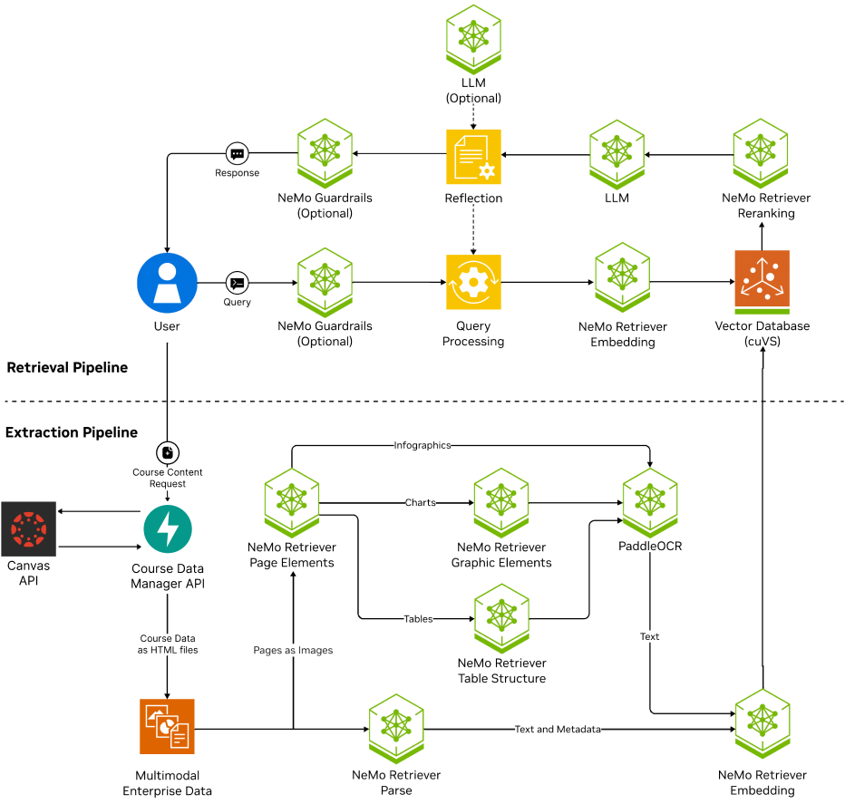

# Virtual Teaching Assistant

## License and Attribution

This project is licensed under the [Apache License 2.0](./LICENSE).

## Upstream NVIDIA Dependencies

This project builds upon and integrates components from the [NVIDIA RAG Blueprint v2.0.0](https://github.com/NVIDIA-AI-Blueprints/rag), which is licensed under the Apache License 2.0. Portions of the original RAG blueprint are located under the `nvidia-rag-2.0` directory. For more information about how it is used in this project, please refer to `/docs/NVIDIA_rag_fork.md`.

All original and modified content is redistributed in compliance with the terms of the Apache License 2.0.

## Overview

This project is a Virtual Teaching Assistant named Dori. It is a chatbot that is designed to help students learn and understand concepts, pulling information from their enrolled canvas courses. The base of this project is the NVIDIA RAG Blueprint, which helped us get setup with the RAG pipeline and guardrails faster. 

## Getting Started
The best starting point is the [Quick Start Guide](./docs/quickstart.md). This guide will walk you through the process of setting up the project and running it.

All other documentation is located in the [docs](./docs) directory. It includes
- [Quick Start Guide](./docs/quickstart.md) A guide to getting things up and running.
- [future improvements](./docs/future_improvments.md) A list of future improvements and recommendations by the team.
- [limitations](./docs/limitations.md) A list of limitations with the current version of the project that we are aware of.
- [guardrails toggle](./docs/guardrails_toggle.md) A guide to enabling guardrails in the frontend of the project.
- [NVIDIA RAG fork](./docs/NVIDIA_rag_fork.md) A document outlining what we changed and why from the NVIDIA RAG repo.

The `nvidia-rag-2.0` directory contains a fork of the NVIDIA RAG repo, which also has its own docs directory from nvida. The [NVIDIA_RAG_FORK.md](./docs/NVIDIA_rag_fork.md) file goes over the only changes made by us.

## Diagram:

